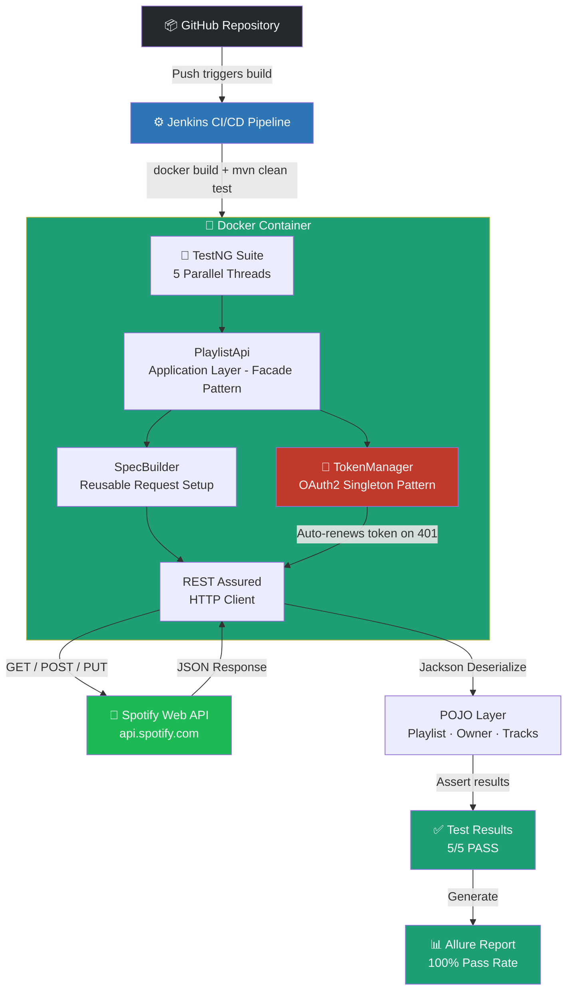

# 🎵 Spotify API Test Automation Framework

> Enterprise-grade REST API automation framework built from scratch using Java, REST Assured, and TestNG — tested against the **live Spotify Web API** with full OAuth2 token management, parallel execution, Docker containerization, and Jenkins CI/CD integration.

---

## 📋 Table of Contents
- [Overview](#overview)
- [Tech Stack](#tech-stack)
- [Framework Architecture](#framework-architecture)
- [Key Features](#key-features)
- [Engineering Challenges & Solutions](#️-engineering-challenges--solutions)
- [Project Structure](#project-structure)
- [Design Patterns](#design-patterns)
- [Test Scenarios](#test-scenarios)
- [How to Run Locally](#how-to-run-locally)
- [Docker](#docker)
- [CI/CD Pipeline](#cicd-pipeline)
- [Test Reports](#test-reports)
- [Author](#author)

---

## Overview

This framework automates REST API testing for the [Spotify Web API](https://developer.spotify.com/documentation/web-api/) — a real-world, OAuth2-protected production API. It was designed and built from scratch to demonstrate enterprise-level API test automation practices including automated token management, reusable request specifications, POJO-based serialization, parallel test execution, Docker containerization, and Jenkins CI/CD integration.

**Live CI/CD build results:**
```
Tests run: 5 | Failures: 0 | Errors: 0 | Skipped: 0
BUILD SUCCESS — Total time: 22 seconds (Docker) / 27 seconds (Jenkins)
```

---

## Tech Stack

| Tool | Version | Purpose |
|------|---------|---------|
| Java | 11 | Core language |
| REST Assured | 5.4.0 | API automation DSL |
| TestNG | 7.10.2 | Test framework & parallel execution |
| Jackson Databind | 2.17.2 | JSON serialization / deserialization |
| Lombok | 1.18.32 | Boilerplate code reduction |
| Allure | 2.27.0 | Test reporting |
| JavaFaker | 1.0.2 | Dynamic test data generation |
| AspectJ | 1.9.22 | Allure + TestNG integration |
| Maven Surefire | 3.2.5 | Test runner & parallel config |
| Docker | Latest | Containerized test execution |
| Jenkins | Latest | CI/CD pipeline |
| GitHub | - | Version control & pipeline trigger |

---

## Framework Architecture

```
┌─────────────────────────────────────────────────────────┐
│                    TEST LAYER                           │
│              PlayListTest.java                          │
│         (Business-readable test cases)                  │
└──────────────────────┬──────────────────────────────────┘
                       │
┌──────────────────────▼──────────────────────────────────┐
│               APPLICATION API LAYER                     │
│                PlaylistApi.java                         │
│      (Abstracts HTTP calls from test logic)             │
└──────────┬───────────────────────────┬──────────────────┘
           │                           │
┌──────────▼───────────┐  ┌────────────▼────────────────┐
│     API LAYER        │  │        POJO LAYER            │
│  SpecBuilder.java    │  │  Playlist / Owner /          │
│  TokenManager.java   │  │  Tracks / Error.java         │
│  RestResource.java   │  │  (Serialization models)      │
│  Route.java          │  └─────────────────────────────┘
│  StatusCode.java     │
└──────────┬───────────┘
           │
┌──────────▼───────────────────────────────────────────┐
│                  UTILS LAYER                          │
│   ConfigLoader | DataLoader | FakerUtils |            │
│   PropertyUtils                                       │
│   (Config management, test data, utilities)           │
└───────────────────────────────────────────────────────┘
```

---

### CI/CD & Execution Flow

The diagram below shows the complete end-to-end execution flow — from a GitHub push all the way through to the Allure report:



**Flow summary:**
- **GitHub push** → triggers Jenkins build automatically
- **Jenkins** → builds Docker image and runs `mvn clean test`
- **Docker** → provides identical execution environment on any machine
- **TokenManager** → automatically renews OAuth2 token when expired (no manual intervention)
- **5 parallel threads** → execute simultaneously with zero data collision
- **Allure** → generates visual report with full request/response details

---


## Key Features

### ✅ Automated OAuth2 Token Management
The `TokenManager` class automatically detects when an access token has expired (HTTP 401 response) and renews it by firing a POST request to the Spotify token endpoint — without any manual intervention. This means the Jenkins pipeline and Docker container can run on any schedule without breaking due to token expiry.

```
Flow: API Call → 401 Detected → POST /api/token → Fresh Token → Retry
```

### ✅ Docker Containerization
The framework runs inside a Docker container — guaranteeing identical test execution on any machine, any OS, and any CI/CD environment. No "works on my machine" problems.

```bash
docker build -t spotify-test-framework .
docker run -e CLIENT_ID=xxx -e CLIENT_SECRET=xxx spotify-test-framework
```

### ✅ Reusable REST Assured Specifications
`SpecBuilder.java` provides centralized, reusable `RequestSpecification` and `ResponseSpecification` objects — eliminating duplication across all test classes and ensuring consistent headers, base URIs, and content types.

### ✅ POJO-Based Serialization & Deserialization
All request bodies and response payloads are mapped to Java POJOs using Jackson Databind. Lombok annotations (`@Getter`, `@Setter`, `@Builder`) eliminate boilerplate getter/setter code.

### ✅ Parallel Test Execution
Tests run across 5 concurrent threads via Maven Surefire configuration — significantly reducing total execution time compared to sequential runs.

### ✅ Dynamic Test Data Generation
`FakerUtils.java` uses JavaFaker to generate unique playlist names and descriptions for every test run — ensuring tests are never dependent on hardcoded static data.

### ✅ Positive & Negative Scenario Coverage
The framework tests both success paths and failure paths — including expired token handling (401), missing required field validation (400), and full CRUD operations (GET, POST, PUT).

### ✅ Allure Test Reporting
Allure reports provide rich visual test execution reports with request/response details, step-by-step breakdowns, and pass/fail history.

### ✅ Jenkins CI/CD Integration
Full pipeline integration — Jenkins pulls from GitHub, compiles, executes tests with environment variable injection, and reports results automatically.

---

## ⚙️ Engineering Challenges & Solutions

Building an enterprise-grade framework from scratch involves solving real-world constraints that tutorials never cover. Here are the four core challenges encountered during development and exactly how each was resolved:

### 1. The "Token Expiry" Bottleneck

**Challenge:** The Spotify Web API requires OAuth2 authentication, and tokens expire frequently. Hardcoding tokens or manually refreshing them breaks any CI/CD or nightly scheduling, making it impossible to achieve "hands-off" automation.

**Solution:** I implemented a custom `TokenManager` class using the **Singleton Pattern**. The framework now performs a proactive "check-and-refresh" logic: if a request returns a `401 Unauthorized` status code, the `TokenManager` transparently handles the POST request to the token endpoint to fetch a new token, updates the header, and retries the original request — all without test interruption.

```
Flow: API Call → 401 Detected → TokenManager.renewToken() → Fresh Token → Retry → ✅ Pass
```

---

### 2. Ensuring "Works on My Machine" Parity

**Challenge:** Developing on a local machine (macOS/Windows) often leads to environmental dependencies that fail when moved to a shared Jenkins server or a different developer's environment (e.g., mismatched Java versions or library paths).

**Solution:** I containerized the entire framework using **Docker**. By creating a standardized `Dockerfile`, I decoupled the test environment from the host OS. This ensures the test suite runs with 100% consistency across my local environment, Jenkins agents, and any future cloud-based execution platform.

| Environment | Tests | Result | Time |
|---|---|---|---|
| Local Eclipse | 5/5 | ✅ PASS | ~15s |
| Docker Container | 5/5 | ✅ PASS | 36s |
| Jenkins CI/CD | 5/5 | ✅ PASS | 14s |

---

### 3. Preventing Data Collision in Parallel Execution

**Challenge:** Running tests in parallel (5 concurrent threads via TestNG/Surefire) created the risk of data contention or race conditions — especially during authentication and playlist creation where hardcoded data would cause conflicts.

**Solution:**
- **Data Isolation:** Integrated `JavaFaker` to generate unique, random playlist names and descriptions for every execution, ensuring that concurrent threads never collide on test data.
- **Thread Safety:** Designed the `TokenManager` to be thread-safe using the Singleton pattern, preventing multiple threads from firing simultaneous refresh requests — which preserves API rate limits and prevents authentication errors.

---

### 4. Improving Debugging Efficiency

**Challenge:** When a test fails in a CI/CD pipeline, reading raw console logs is time-consuming and often lacks sufficient context for a quick root-cause analysis.

**Solution:** I integrated **Allure Reporting** with the framework. By leveraging `@Step` annotations and automatic attachment of request/response payloads, I transformed CI/CD failure logs into rich, visual reports. This reduced the "mean time to repair" (MTTR) by allowing stakeholders to pinpoint failures visually without needing to re-run the build locally.

---

## Project Structure

```
src/
├── main/java/
│   └── RestAssuredFramework/
│       └── App.java
│
└── test/
    ├── java/
    │   └── com/spotify/oauth2/
    │       ├── api/
    │       │   ├── RestResource.java
    │       │   ├── Route.java
    │       │   ├── SpecBuilder.java
    │       │   ├── StatusCode.java
    │       │   ├── TokenManager.java
    │       │   └── applicationApi/
    │       │       └── PlaylistApi.java
    │       ├── pojo/
    │       │   ├── Error.java
    │       │   ├── ExternalUrls.java
    │       │   ├── InnerError.java
    │       │   ├── Owner.java
    │       │   ├── Playlist.java
    │       │   └── Tracks.java
    │       ├── tests/
    │       │   ├── BaseTest.java
    │       │   └── PlayListTest.java
    │       └── utils/
    │           ├── ConfigLoader.java
    │           ├── DataLoader.java
    │           ├── FakerUtils.java
    │           └── PropertyUtils.java
    └── resources/
        ├── config.properties
        ├── data.properties
        └── allure.properties
```

---

## Design Patterns

### Singleton Pattern — `TokenManager`
Ensures only one token renewal process runs at a time across all parallel threads — preventing race conditions and duplicate refresh requests during concurrent test execution.

### Builder Pattern — POJOs with Lombok
```java
Playlist playlist = Playlist.builder()
    .name(faker.name().fullName())
    .description(faker.lorem().sentence())
    .isPublic(false)
    .build();
```

### Facade Pattern — `PlaylistApi`
```java
PlaylistApi.post(playlist);
PlaylistApi.get(playlistId);
PlaylistApi.update(playlistId, updatedPlaylist);
```

---

## Test Scenarios

| Test | Type | HTTP Method | Expected Status |
|------|------|-------------|----------------|
| `ShouldBeableToGetAPlaylist` | Positive | GET | 200 OK |
| `ShouldBeableTocreatePlaylist` | Positive | POST | 201 Created |
| `ShouldBeableToUpdateAPlaylist` | Positive | PUT | 200 OK |
| `ShouldnotBeableTocreatePlaylistWithExpiredToken` | Negative | POST | 401 Unauthorized |
| `ShouldnotBeableTocreatePlaylistWithoutname` | Negative | POST | 400 Bad Request |

---

## How to Run Locally

### Prerequisites
- Java 11+
- Maven 3.6+
- Spotify Developer account with app credentials

### Environment Variables
```
BASE_URI=https://api.spotify.com
ACCOUNT_BASE_URI=https://accounts.spotify.com
CLIENT_ID=your_spotify_client_id
CLIENT_SECRET=your_spotify_client_secret
REFRESH_TOKEN=your_refresh_token
USER_ID=your_spotify_user_id
```

> ⚠️ Never hardcode credentials. Always pass them as environment variables.

### Run all tests
```bash
mvn clean test \
  -DBASE_URI=https://api.spotify.com \
  -DACCOUNT_BASE_URI=https://accounts.spotify.com
```

### Generate Allure report
```bash
mvn allure:serve
```

---

## Docker

Run the entire test suite inside a Docker container — identical results on any machine.

### Prerequisites
- [Docker Desktop](https://www.docker.com/products/docker-desktop) installed and running

### Build the image
```bash
docker build -t spotify-test-framework .
```

### Run tests
```bash
docker run \
  -e CLIENT_ID=your_spotify_client_id \
  -e CLIENT_SECRET=your_spotify_client_secret \
  -e REFRESH_TOKEN=your_refresh_token \
  -e USER_ID=your_spotify_user_id \
  spotify-test-framework
```

### Expected output
```
Tests run: 5, Failures: 0, Errors: 0, Skipped: 0
BUILD SUCCESS
Total time: 22 seconds
```

### Why Docker?
- ✅ Identical execution on any OS — Windows, Mac, Linux
- ✅ No environment setup required on new machines
- ✅ Clean isolated container for every test run
- ✅ Credentials passed securely as environment variables
- ✅ Ready for cloud CI/CD environments

---

## CI/CD Pipeline

Integrated with **Jenkins** — triggered automatically on every GitHub push.

```
GitHub Push → Jenkins pulls → mvn clean test → 5 parallel threads → BUILD SUCCESS
```

**Sample build output:**
```
Tests run: 5, Failures: 0, Errors: 0, Skipped: 0
BUILD SUCCESS — Total time: 27.063 s
```

---

## Test Reports

Allure reports generated after each run include full request/response details, step-by-step execution breakdown, and historical trends.

```bash
mvn allure:serve
```

---

## Author

**Suranjit Biswas**
- GitHub: [@bsuranjit](https://github.com/bsuranjit)
- LinkedIn: [linkedin.com/in/suranjit-biswas-21932b216](https://linkedin.com/in/suranjit-biswas-21932b216)
- Email: biswassuranjit76@gmail.com

---

## License

This project is open source and available under the [MIT License](LICENSE).
